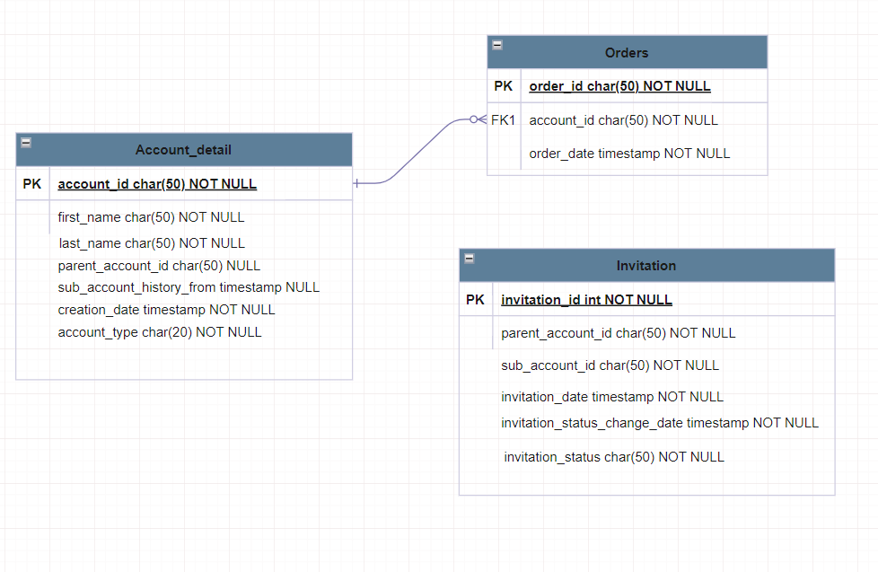

Assumptions :
1. No need to handle user login or logout part as part of this assignment. To get and store the logged in account id, here i have create simple api(path : /login) which just validates if account id exist and store the account id value to be used by other api.
2. Assuming individual account creation flow is already implemented. Here i have created a basic api(/account/create) to create a sample data.
3. for this requirement "A SupplyHouse account shall have the ability to request to upgrade their account to a business owner account. If the account has placed at least 10 orders within the past year, the request will be approved.", assuming upgrade request should atomatically processed based on number of orders. no manual intervention required.

Notes : 
Before executing any Order management or Account management related apis,
please make sure you do login through login API(/login) as actual authentication and authorization part is 
not implemented as part of this assignment.
Actual authentication and authorization can be handled using generic Authentication filter along with Spring security

Database schema :

API Documentation :
http://localhost:8080/supplyhouse/swagger-ui/index.html

H2 Database console :
http://localhost:8080/supplyhouse/h2-console
